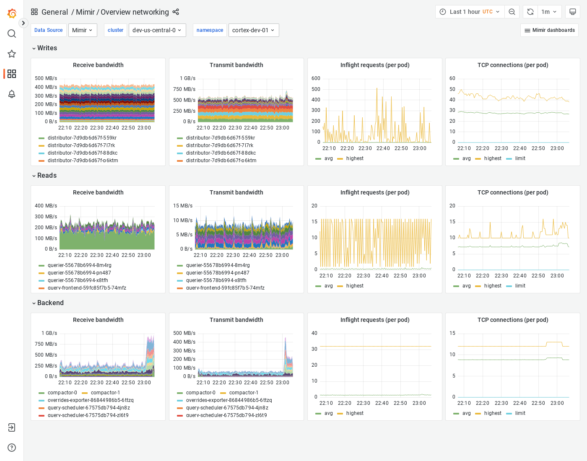

# Grafana Mimir Overview networking dashboard

The Overview networking dashboard shows receive and transmit bandwidth, in-flight requests, and TCP connections.
The dashboard groups Mimir components into "Writes", "Reads" and "Backend".

This dashboard requires [additional resources metrics]().

## Example

The following example shows a Overview networking dashboard from a demo cluster.

