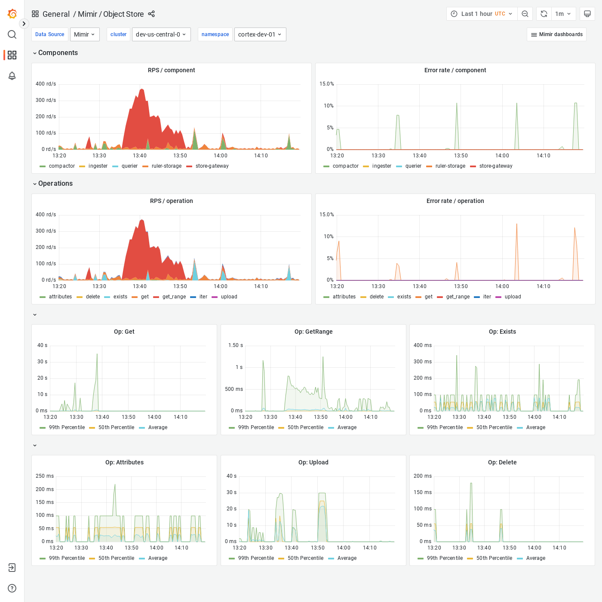

# Grafana Mimir Object Store dashboard

The Object Store dashboard shows an overview of all activity and operations run by any Grafana Mimir component on the object storage.

## Example

The following example shows an Object Store dashboard from a demo cluster.

