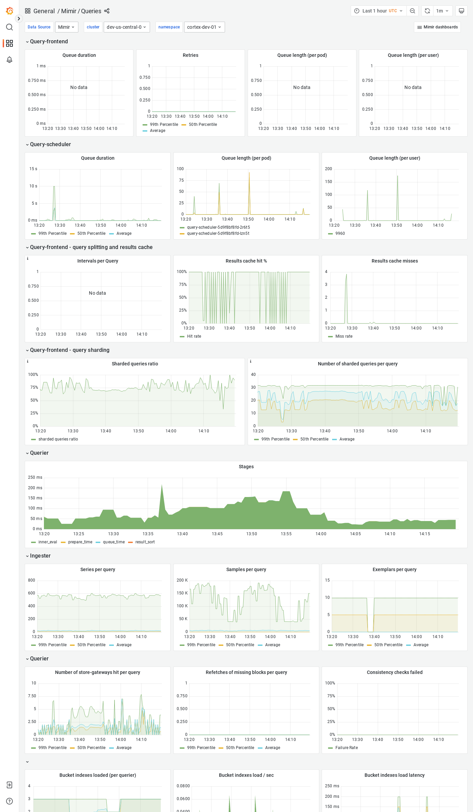

# Grafana Mimir Queries dashboard

The Queries dashboard shows information about query queues, duration, retries, and details about query execution performance.

## Example

The following example shows a Queries dashboard from a demo cluster.

