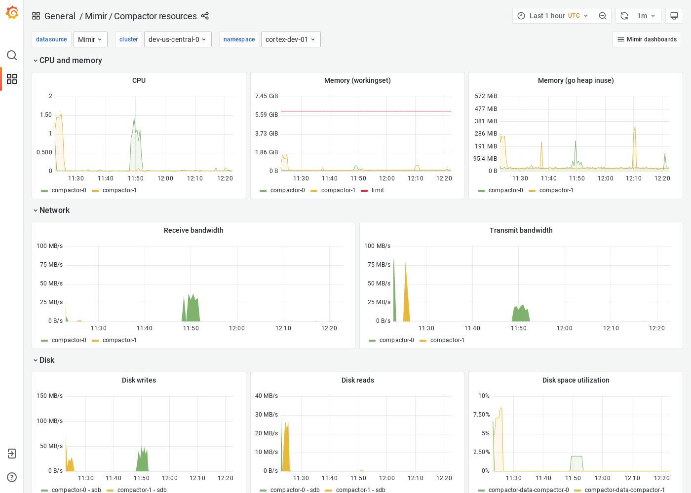

# Grafana Mimir Compactor resources dashboard

The Compactor resources dashboard shows CPU, memory, disk, and networking metrics for the compactor.

This dashboard requires [additional resources metrics]().

## Example

The following example shows a Compactor resources dashboard from a demo cluster.

