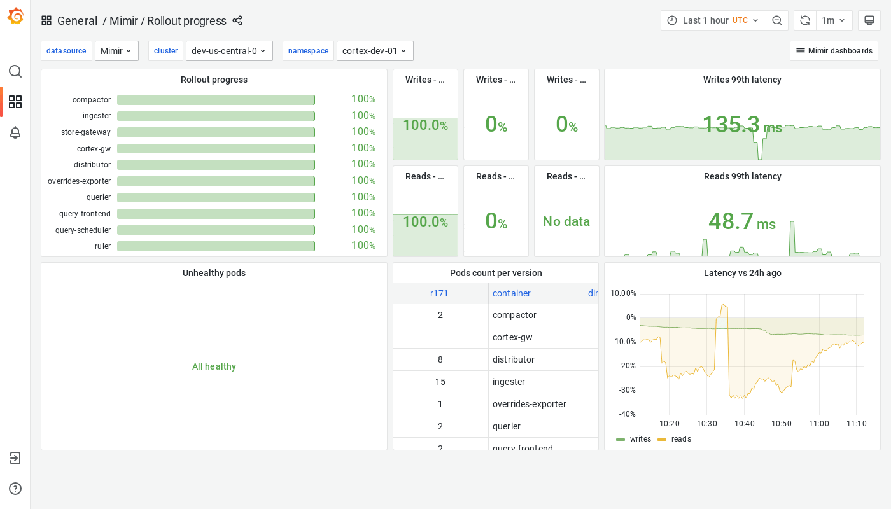

# Grafana Mimir Rollout progress dashboard

The Rollout progress dashboard shows the progress of a rollout across a Grafana Mimir cluster and key metrics you can monitor, such as failure rates and latency.

## Example

The following example shows a Rollout progress dashboard from a demo cluster.

