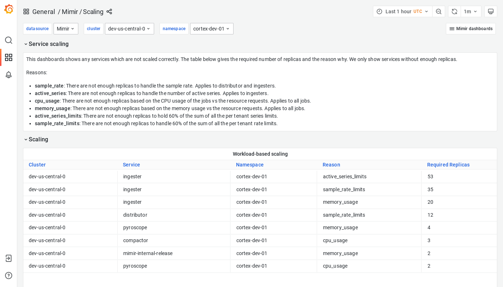

# Grafana Mimir Scaling dashboard

The Scaling dashboard suggests services that should be scaled up in the event of a failure for one of several specific reasons.
These suggestions are meant to serve as helpful guidelines rather than prescriptive requirements.

## Example

The following example shows a Scaling dashboard from a demo cluster.

