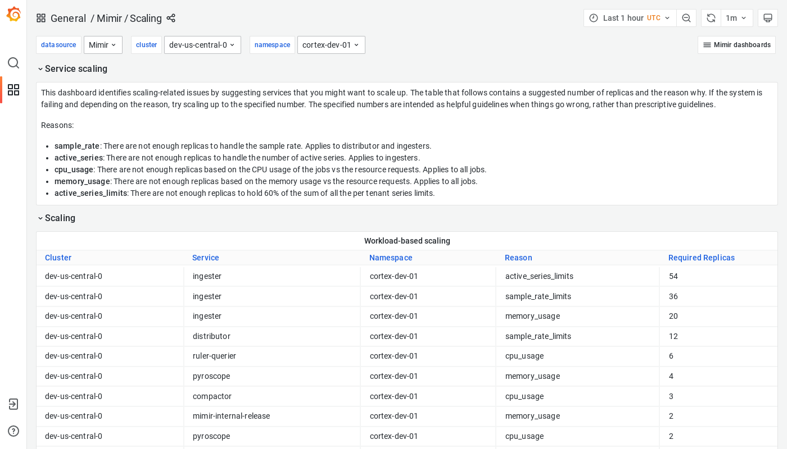

# Grafana Mimir scaling dashboard

The scaling dashboard displays services that you can optionally scale up, in the event of a failure that is caused by one or more specific reasons.

## Example

The following example shows a Scaling dashboard from a demo cluster.

