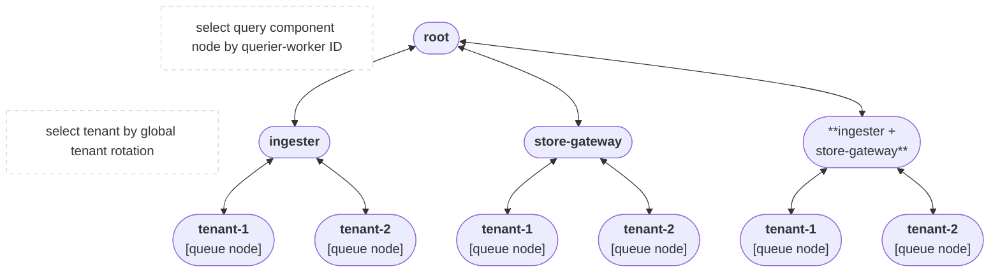
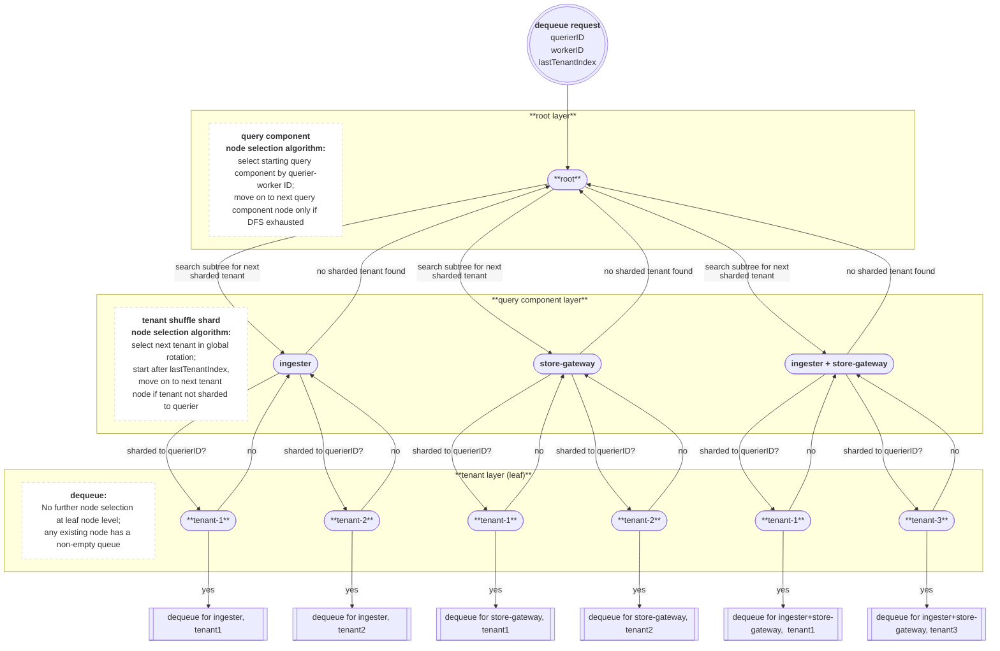

## Query Request Queue Design: Queue Splitting and Prioritization

The `RequestQueue` subservice embedded into the scheduler process is responsible for
all decisions regarding enqueuing and dequeuing of query requests.
While the `RequestQueue`'s responsibilities are relatively broad, including the domain logic for
querier-worker connection lifecycles and graceful startup/shutdown logic,
the queuing logic is isolated into a "tree queue" structure and its associated queue algorithms.

### Tree Queue: What and Why

The "tree queue" structure serves the purpose of a discrete priority queue.
Rather than a single queue, the requests are split into many queues,
each of which is located at a leaf node in the tree structure.

The tree structure enables some of the specific requirements of our queue selection algorithms:

- we must select a queue to dequeue from based on two independent algorithms, each with their own state
- there is a hierarchy of importance between the two algorithms - one is primary, the other secondary
- one of the algorithms (tenant-querier shuffle shard) can reject all queue options presented to it,
  requiring us to return back up to the previous level of queue selection to continue searching.

These requirements lend themselves to a search tree or decision tree structure;
the levels of the tree express a clear hierarchy of decisonmaking between the two algorithms,
and the depth-first traversal provides a familiar pattern for searching for a leaf node to dequeue from.

#### Simplified Diagram

For brevity, we omit the `unknown` query component node and its subtree,
as the algorithm to select query component nodes treats `unknown` the same as `ingester-and-store-gateway`.

#### Enqueuing to the Tree Queue

On enqueue, we partition requests into separate queues based on two static properties of the query request:

- the "expected query component"
  - `ingester`, `store-gateway`, `ingester-and-store-gateway`, or `unknown`
- the tenant ID of the request

These properties are used to place the request into a queue at a leaf node.
A request from `tenant-1` which is expected to only utilize ingesters
will be enqueued at the leaf node reached by the path `root -> ingester -> tenant-1`.

#### Dequeuing from the Tree Queue

On dequeue, we perform a depth-first search of the tree structure to select a leaf node to dequeue from.
Each of the two non-leaf levels of the tree uses a different algorithm to select the next child node.

1. At the root node level, one algorithm selects one of four possible query component child nodes.
1. At query component level, the other algorithm attempts to select a tenant-specific child node.
   1. due to tenant-querier shuffle sharding, it is possible that none of the tenant nodes
      can be selected for dequeuing for the current querier.
1. If a tenant node is selected, the search dequeues from it as it has reached a leaf node.
1. If no tenant node is selected, the search returns back up to the root node level
   and selects the next query component child node to continue the search from.

#### Full Diagram

### Deep Dive: Queue Selection Algorithms

#### Context & Requirements

##### Original State: Queue Splitting by Tenant

The `RequestQueue` originally utilized only a single dimension of queue splitting, by tenant.
The structure and queue selection served to accomplish two purposes:

1. tenant fairness via a simple round-robin between all tenants with non-empty query request queues
1. rudimentary tenant isolation via shuffle-sharding noisy tenants to only a subset of queriers

While this inter-tenant Quality-Of-Service approach has worked well,
we observed other QOS issues arising from the varying characteristics of Mimir's two "query components"
utilized by the queriers to fetch TSDB data for executing queries: ingesters and store-gateways.

##### New Requirement: Queue Splitting by Query Component

Ingesters serve requests for recent data, and store-gateways serve requests for older data.
While queries can overlap the time periods of data fetched by both query components,
many requests are served by only one of the two components.
In particular, recording and alerting queries are typically focused on current system state
and therefore often only require the recent data from ingesters.

Ingesters and store-gateways tend to experience issues independently of each other,
but when one component was in a degraded state, queries which only utilized the other component
would still have to wait in the queue, leading to latency and ultimately timeouts and cancelletions
for queries that should have been able to be serviced by the non-degraded query component.

#### Phase 1: Query Component Selection by Round-Robin

In the first phase, we believed that it would be enough to duplicate the tenant queue splitting approach.
We split the tenant queues further by query component, so that each tenant could have up to four queues.

With the addition of another split, we introduced the "tree queue" structure, inspired by Loki's implementation.
The tree queue allowed more clear management of the two dimensions of queue splitting rather than one.

For simplicity at this stage, the tenant selection algorithm was kept higher in the tree
and therefore took priority of the query component queue selection algorithm.
Additionally, the query component selection algorithm was a simple round-robin.

This phase was a failure due to both of those design decisions.

##### Failure 1: Tenant Selection Priority over Query Component Selection (minor)

The fact that the tenant selection was done first meant that a tenant's query traffic profile
could essentially cause the query component round-robin to be irrelevant.
With tenant selection done first, the decision pattern is essentially:

> We are going to dequeue something for `tenant-1` no matter what.
> We will _try_ to dequeue for a different query component than last time if we can,
> but if `tenant-1` has no requests for that component, we will move on
> and dequeue something from the same query componennt as last time anyway.

If it was in the interest of the system to dequeue for a query for the store-gateways
but we had selected `tenant-1` which was only sending ingester query at the time,
we would dequeue an ingester query because the tenant selection had priority over the query component selection.

##### Failure 2: Inability to Prevent Connection Pool Exhaustion (major)

<!--The structure had a simple hashmap mapping tenant IDs to a queue,-->
<!--and rotated through a global list of active tenantIDs.-->
<!--to select the next tenant sharded to the waiting querier.-->
