# Query Request Queue Design: Queue Splitting and Prioritization

The `RequestQueue` subservice embedded into the scheduler process is responsible for
all decisions regarding enqueuing and dequeuing of query requests.
While the `RequestQueue`'s responsibilities are relatively broad, including management of
querier-worker connection lifecycles and graceful startup/shutdown,
the queuing logic is isolated into a "tree queue" structure and its associated queue algorithms.

## Tree Queue: What and Why

The "tree queue" structure serves the purpose of a discrete priority queue.
The requests are split into many queues, each of which is located at a leaf node in the tree structure.

The tree structure enables some of the specific requirements of our queue selection algorithms:

- we must select a queue to dequeue from based on two independent algorithms, each with their own state
- there is a hierarchy of importance between the two algorithms - one is primary, the other secondary
- one of the algorithms (tenant-querier shuffle shard) can reject all queue options presented to it,
  requiring us to return back up to the previous level of queue selection to continue searching.

These requirements lend themselves to a search tree or decision tree structure;
the levels of the tree express a clear hierarchy of decisonmaking between the two algorithms,
and the depth-first traversal provides a familiar pattern for searching for a leaf node to dequeue from.

### Diagram: Dequeue Decision Tree (Simplified)

For diagrams in this doc, we omit the `unknown` query component node and its subtree to save space.
The system treats `unknown` the same as `ingester-and-store-gateway`.

### Enqueuing to the Tree Queue

On enqueue, we partition requests into separate queues based on two static properties of the query request:

- the "expected query component"
  - `ingester`, `store-gateway`, `ingester-and-store-gateway`, or `unknown`
- the tenant ID of the request

These properties are used to place the request into a queue at a leaf node.
A request from `tenant-1` which is expected to only utilize ingesters
will be enqueued at the leaf node reached by the path `root -> ingester -> tenant-1`.

### Dequeuing from the Tree Queue

On dequeue, we perform a depth-first search of the tree structure to select a leaf node to dequeue from.
Each of the two non-leaf levels of the tree uses a different algorithm to select the next child node.

1. At the root node level, one algorithm selects one of four possible query component child nodes.
1. At query component level, the other algorithm attempts to select a tenant-specific child node.
   1. due to tenant-querier shuffle sharding, it is possible that none of the tenant nodes
      can be selected for dequeuing for the current querier.
1. If a tenant node is selected, the search dequeues from it as it has reached a leaf node.
1. If no tenant node is selected, the search returns back up to the root node level
   and selects the next query component child node to continue the search from.

### Diagram: Dequeue Decision Tree (Full)

## Deep Dive: Queue Selection Algorithms

### Context & Requirements

### Original State: Queue Splitting by Tenant

The `RequestQueue` originally utilized only a single dimension of queue splitting, by tenant.
This approach served two purposes:

1. tenant fairness via a simple round-robin between all tenants with non-empty query request queues
1. rudimentary tenant isolation via shuffle-shard assignment of noisy tenants to only a subset of queriers

While this inter-tenant Quality-Of-Service approach has worked well,
other QOS issues have arisen from the varying characteristics of Mimir's two "query components"
utilized by the queriers to fetch TSDB data for executing queries: ingesters and store-gateways.

### New Requirement: Queue Splitting by Query Component

Ingesters serve requests for recent data, and store-gateways serve requests for older data.
While queries can overlap the time periods of data fetched by both query components,
many requests are served by only one of the two components.

Ingesters and store-gateways tend to experience issues independently of each other,
but when one component was in a degraded state, _all_ queries would wait in the queue behind the slow queries,
causing high latency and timeouts for queries which could have been serviced by the non-degraded query component.

### Phase 1: Query Component Selection by Round-Robin

In the first phase, we believed that it would be sufficient to duplicate the tenant queue splitting approach.
We split the tenant queues further by query component, so that each tenant could have up to four queues.

To enable more clear management of the two dimensions of queue splitting rather than one,
we introduced the "tree queue" structure, inspired by Loki's implementation.

For simplicity at this stage, the tenant selection algorithm was kept higher in the tree
and therefore took priority over the query component queue selection algorithm.
Additionally, the query component selection algorithm was a simple round-robin.

This phase was a failure due to both of those design decisions.

#### Failure 1: Tenant Selection Priority over Query Component Selection (minor)

The fact that the tenant selection was given priority over query-component selection
meant that a tenant's query traffic profile could override the query component round-robin.

If the tenant rotation had selected `tenant-1` which was only sending ingester queries at the time,
the round-robin algorithm could only select the ingester queue from the child queue nodes for `tenant-1`,
overriding the intended progression of the query component round-robin.

#### Failure 2: Inability to Prevent Processing Time Dominance by Slow Queries (major)

A vanilla round-robin algorithm does not sufficiently guard against a high-latency component
saturating all or nearly all connections with requests in flight in the slow component.
Despite rotating which query component is dequeued for, utilization of the querier-worker connection pool
as measured by inflight query processing time will grow asymptotically to be dominated by the slow query component.

### Phase 2: Query Component Selection to Solve Processing Time Dominance by Slow Queries

#### Modeling the Problem

To demonstrate the issue, we can simplify the system to two query components and four querier connections.
Queries to the "slow" query component take 8 ticks to process while queries to the "fast" query component take 1 tick.
The round-robin selection advances from fast to slow or vice versa with each dequeue.

In 64 ticks (16 each for 4 connections), the system:

- dequeues and starts processing 16 queries: 8 fast, 8 slow
- completes processing 13 queries: 8 fast, 5 slow
- spends 8 ticks processing the fast queries
- spends 56 ticks processing the slow queries

##### Diagram: Query Processing Time Utilization with Round-Robin

```mermaid
---
title: Query Processing Time Utilization with Round-Robin
config:
  gantt:
    displayMode: compact
    numberSectionStyles: 2
  theme: default
---
gantt
    dateFormat ss
    axisFormat %S
    tickInterval 1second

    section consumer-1
        fast        :active, c1-1, 00, 1s
        fast        :active, c1-2, 01, 1s
        fast        :active, c1-3, 02, 1s
        slow        :done, c1-4, 03, 8s
        slow...     :done, c1-5, 11, 5s

    section consumer-2
        slow        :done, c2-1, 00, 8s
        fast        :active, c2-2, 08, 1s
        fast        :active, c2-3, 09, 1s
        fast        :active, c2-4, 10, 1s
        fast        :active, c2-5, 11, 1s
        slow...     :done, c2-6, 12, 4s

    section consumer-3
        fast        :active, c3-1, 00, 1s
        slow        :done, c3-2, 01, 8s
        slow...     :done, c3-3, 09, 7s

    section consumer-4
        slow        :done, c4-1, 00, 8s
        slow        :done, c4-2, 08, 8s

```

<!--The structure had a simple hashmap mapping tenant IDs to a queue,-->
<!--and rotated through a global list of active tenantIDs.-->
<!--to select the next tenant sharded to the waiting querier.-->

### Solution: Query Component Partitioning by Querier-Worker

This solution is inspired by a research paper from Brown University and Microsoft:
[Two-Dimensional Fair Queuing for Multi-Tenant Cloud Services](https://people.mpi-sws.org/~jcmace/papers/mace20162dfq.pdf).

Querier-worker connections are partitioned evenly across up to four possible query-component nodes
with a modulo of the querier-worker connection ID across the ordered list of nodes.

Ex:
Assume a query component node order of `[ingester, store-gateway, ingester-and-store-gateway, unknown]`.

- querier-worker connection IDs `0`, `4`, `8`, etc. would be assigned to `ingester`
- querier-worker connection IDs `1`, `5`, `9`, etc. would be assigned to `store-gateway`
- etc. for `ingester-and-store-gateway`, and `unknown`

We conservatively expect degradation of the store-gateway query component will cause high latency
for the queries in the `store-gateway`, `ingester-and-store-gateway`, and `unknown` queues,
but by partitioning the querier-worker connections evenly across the four queues,
25% of connections remain reserved to process queries from the `ingester` queue.

The primary measure of success is the servicing of the queries to the non-degraded query component,
In real-world scenarios the slow queries are often slow enough to hit timeouts,
and the majority of those queries will be expected to fail until the component recovers.

#### Modeling the Solution

Again we simplify the system to two query components and four querier connections.
Queries to the "slow" query component take 8 ticks to process while queries to the "fast" query component take 1 tick.

In 64 ticks (16 each for 4 connections), the new system:

- dequeues and starts processing 36 queries: 32 fast, 4 slow
- completes processing 36 queries: 32 fast, 4 slow
- spends 32 ticks processing the fast queries
- spends 32 ticks processing the slow queries

Compare with the `Query Processing Time Utilization with Round-Robin` results and diagram above.
The new system allocates more query processing time to the fast queries
and completes 8x more fast queries than the original system in the same time period.

##### Diagram: Query Processing Time Utilization with Querier-Worker Queue Prioritization

```mermaid
---
title: Query Processing Time Utilization with Querier-Worker Queue Prioritization
config:
  gantt:
    displayMode: compact
    numberSectionStyles: 2
  theme: default
---
gantt
    dateFormat ss
    axisFormat %S
    tickInterval 1second

    section consumer-1
        fast        :active, c1-1, 00, 1s
        fast        :active, c1-2, 01, 1s
        fast        :active, c1-3, 02, 1s
        fast        :active, c1-4, 03, 1s
        fast        :active, c1-5, 04, 1s
        fast        :active, c1-6, 05, 1s
        fast        :active, c1-7, 06, 1s
        fast        :active, c1-8, 07, 1s
        fast        :active, c1-9, 08, 1s
        fast        :active, c1-10, 09, 1s
        fast        :active, c1-11, 10, 1s
        fast        :active, c1-12, 11, 1s
        fast        :active, c1-13, 12, 1s
        fast        :active, c1-14, 13, 1s
        fast        :active, c1-15, 14, 1s
        fast        :active, c1-16, 15, 1s

    section consumer-2
        fast        :active, c2-1, 00, 1s
        fast        :active, c2-2, 01, 1s
        fast        :active, c2-3, 02, 1s
        fast        :active, c2-4, 03, 1s
        fast        :active, c2-5, 04, 1s
        fast        :active, c2-6, 05, 1s
        fast        :active, c2-7, 06, 1s
        fast        :active, c2-8, 07, 1s
        fast        :active, c2-9, 08, 1s
        fast        :active, c2-10, 09, 1s
        fast        :active, c2-11, 10, 1s
        fast        :active, c2-12, 11, 1s
        fast        :active, c2-13, 12, 1s
        fast        :active, c2-14, 13, 1s
        fast        :active, c2-15, 14, 1s
        fast        :active, c2-16, 15, 1s


    section consumer-3
        slow        :done, c3-1, 00, 8s
        slow        :done, c3-2, 08, 8s

    section consumer-4
        slow        :done, c4-1, 00, 8s
        slow        :done, c4-2, 08, 8s

```

#### Caveats: Corner Cases and Things to Know

##### Distribution of Querier-Worker Connections Across Query Component Nodes

**At least 4 querier-worker connections per querier are required to avoid starving a query component node.**
To prevent this, the querier has been updated to create at least 4 connections to each scheduler,
ignoring any `-querier.max-concurrent` value below 4.

**When the total number of querier-worker connections is not evenly divisible by the number of query component nodes,
the modulo distribution will be uneven, with some nodes being assigned one extra connection**.
This is not considered to be an issue.
Queue nodes are deleted as queues are cleared, then recreated in whichever order the queries arrive in.
As the node count and order changes over time, it in turn shuffles which node(s) receive the extra connections.

##### Empty Queue Node Deletion Can Cause Temporary Starvation

As mentioned above, when a queue node is emptied it is deleted from the tree structure
and cannot be selected by the queue selection algorithms.
This can result in the following scenario:

1. Queries to store-gateways are experiencing high latency, causing backup
   in the `store-gateway`, `ingester-and store-gateway`, and `unknown queues`.
2. The ingester-only queries continue to be dequeued and processed by 1/4 of the querier-worker connections.
3. The ingester-only queue is emptied and the `ingester` node is deleted from the tree.
4. The querier-worker connections are now evenly distributed across the remaining three nodes,
   and _all_ connections are now stuck working on slow queries touching the degraded store-gateways.
5. More ingester-only queries arrive and are enqueued at the `ingester` node,
   but no querier-worker connections are available to dequeue them.

This scenario is not desirable, but it is considered an acceptable tradeoff against the alternatives.
As soon as the connections which would be partitioned to the `ingester` node become available again,
they will return to working on the ingester-only queries.

Modeling a simplified system again shows that this scenario still improves on the previous state.

If the fast query queue is cleared and deleted before tick 4 and created again after tick 5,
the fast-query queue consumers will have dequeued slow queries at tick 4 and work on them until tick 12.
At tick 12 they return to being dedicated solely to the fast-query queue.

Despite the temporary fast queue starvation, in 64 ticks (16 each for 4 connections), the new system
still dequeues, starts, and completes processing 22 queries (16 fast, 6 slow) -
still 2x more fast queries than the original system in the same time period.

##### Diagram: Temporary Fast Queue Starvation with Querier-Worker Queue Prioritization

```mermaid
---
title: Temporary Fast Queue Starvation with Querier-Worker Queue Prioritization
config:
  gantt:
    displayMode: compact
    numberSectionStyles: 2
  theme: default
---
gantt
    dateFormat ss
    axisFormat %S
    tickInterval 1second

    section consumer-1
        fast        :active, c1-1, 00, 1s
        fast        :active, c1-2, 01, 1s
        fast        :active, c1-3, 02, 1s
        fast        :active, c1-4, 03, 1s
        slow        :done, c1-5, 04, 8s
        fast        :active, c1-6, 12, 1s
        fast        :active, c1-7, 13, 1s
        fast        :active, c1-8, 14, 1s
        fast        :active, c1-9, 15, 1s

    section consumer-2
        fast        :active, c2-1, 00, 1s
        fast        :active, c2-2, 01, 1s
        fast        :active, c2-3, 02, 1s
        fast        :active, c2-4, 03, 1s
        slow        :done, c2-5, 04, 8s
        fast        :active, c2-6, 12, 1s
        fast        :active, c2-7, 13, 1s
        fast        :active, c2-8, 14, 1s
        fast        :active, c2-9, 15, 1s

    section consumer-3
        slow        :done, c3-1, 00, 8s
        slow        :done, c3-2, 08, 8s

    section consumer-4
        slow        :done, c4-1, 00, 8s
        slow        :done, c4-2, 08, 8s

```

