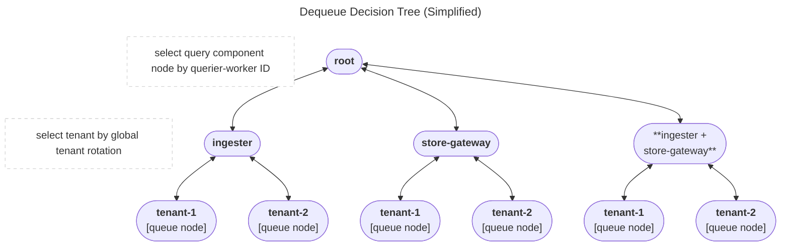
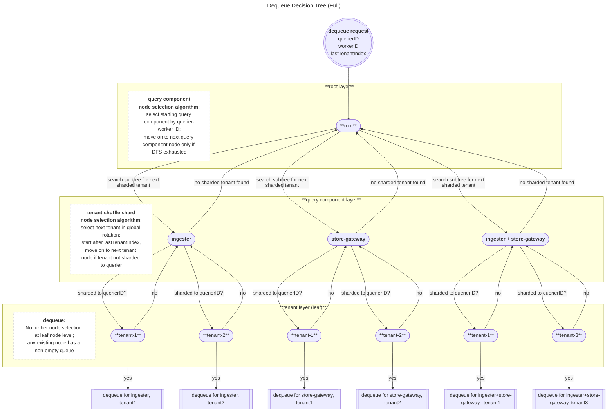
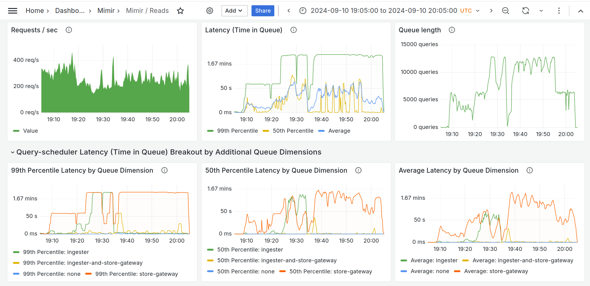

# Query Request Queue Design: Queue Splitting and Prioritization

The `RequestQueue` subservice embedded into the scheduler process is responsible for
all decisions regarding enqueuing and dequeuing of query requests.
While the `RequestQueue`'s responsibilities are relatively broad, including management of
querier-worker connection lifecycles and graceful startup/shutdown,
the queuing logic is isolated into a "tree queue" structure and its associated queue algorithms.

## Tree Queue: What and Why

The "tree queue" structure serves as a discrete priority queue.
Requests are split into many queues, each of which is located at a leaf node in the tree structure.

The tree structure enables some of the specific requirements of our queue selection algorithms:

1. The system must select a queue to dequeue from based on two independent algorithms, each with their own state:
   1. A query component selection for isolation of query component latency effects
   1. A global tenant rotation for tenant fairness, with configurable shuffle-sharding
1. There is a decision hierarchy between the two queue selection algorithms
   1. For the same inputs, queue selection first by query component, then by tenant
      will often result in a different outcome than queue selection first by tenant, then by query component
   1. In order to effectively isolate query component latency effects,
      the query component selection algorithm must take precedence over tenant rotation
1. The tenant rotation algorithm can reject all queue options presented to it when shuffle-sharding is enabled;
   1. In order to minimize idle querier capacity, the system must be able to
      return up to the query component selection level to continue the search

These requirements lend themselves to a search tree or decision tree structure;
the levels of the tree express a clear hierarchy of decisonmaking between the two algorithms,
and the depth-first traversal provides a familiar pattern for searching for a leaf node to dequeue from.

### Diagram: Dequeue Decision Tree (Simplified)

> [!NOTE]
> The system maintains a fourth query component, `unknown`, which is treated the same as `ingester-and-store-gateway`.
> The `unknown` query component node and its subtree are omitted from diagrams in this doc for simplicity.



### Enqueuing to the Tree Queue

On enqueue, we partition requests into separate queues based on two static properties of the query request:

- the "expected query component"
  - `ingester`, `store-gateway`, `ingester-and-store-gateway`, or `unknown`
- the tenant ID of the request

These properties are used to place the request into a queue at a leaf node.
A request from `tenant-1` which is expected to only utilize ingesters
will be enqueued at the leaf node reached by the path `root -> ingester -> tenant-1`.

This results in `O(m * n)` queues in the tree structure:

- `m` is the number of active query component nodes; `m` is always `<= 4`
- `n` is the number of active tenant nodes; `n` is only bounded by the total active tenant count in a multi-tenant Mimir deployment

### Dequeuing from the Tree Queue

On dequeue, we perform a depth-first search of the tree to select a leaf node to dequeue from.
Each of the two non-leaf levels of the tree uses a different algorithm to select the next child node.

1. At the root node level, one algorithm selects one of four possible query component child nodes.
1. At query component level, the other algorithm attempts to select a tenant-specific child node.
   1. due to tenant-querier shuffle sharding, it is possible that none of the tenant nodes
      can be selected for dequeuing for the current querier.
1. If a tenant node is selected, the search dequeues from it as it has reached a leaf node.
1. If no tenant node is selected, the search returns back up to the root node level
   and selects the next query component child node to continue the search from.

### Diagram: Dequeue Decision Tree (Full)



## Deep Dive: Queue Selection Algorithms

### Context & Requirements

### Original State: Queue Splitting by Tenant

The `RequestQueue` originally utilized only a single dimension of queue splitting, by tenant.
This approach served two purposes:

1. tenant fairness via a simple round-robin between all tenants with non-empty query request queues
1. rudimentary tenant isolation via shuffle-shard assignment of noisy tenants to only a subset of queriers

While this inter-tenant Quality-of-Service approach has worked well,
other QoS issues have arisen from the varying characteristics of Mimir's two "query components"
utilized by the queriers to fetch TSDB data for executing queries: ingesters and store-gateways.

### New Requirement: Isolating Query Component Latency Effects

Ingesters serve requests for recent data, and store-gateways serve requests for older data.
While queries can span the time periods served by both query components,
many requests are served by only one of the two components.

Ingesters and store-gateways tend to experience issues independently of each other,
but when one component was in a degraded state, _all_ queries would wait in the queue behind the slow queries,
causing high latency and timeouts for queries which could have been serviced by the non-degraded query component.

#### Goals

The primary goal of the new design solution is to keep queries which only require the non-degraded query component
moving through the queue and being processed, rather than waiting in the queue behind the slow queries.

#### Non-Goals

In real-world scenarios queries to the degraded query component are often slow enough to hit timeouts,
and the majority of those queries will be expected to fail until the component recovers.
It is not a goal of the new design to solve the problem of latency in the degraded query component,
whether through rate limiting of the queries dequeued to that component or through any other intervention.

#### Constraints

The solution should maintain high utilization of queriers while there are still any requests in the queue.
Querier capacity should not be permanently "reserved" for any query type;
as there is no guarantee of when that query type will be enqueued again,
permanent capacity reservation could result resource under-utilization and waste.

### Solution 1: Queue Splitting by Query Component and Query Component Selection by Round-Robin

Tenant queues were split again by query component, resulting in up to four queues per tenant.

With queues now split and selected by two dimensions rather than one,
we introduced the "tree queue" structure, inspired by Loki's implementation.

This solution attempted to minimize the complexity of changes:

1. the tenant selection algorithm was kept higher in the tree
   and therefore took priority over the query component queue selection algorithm.
1. the query component selection algorithm was a simple round-robin.

These design decisions resulted in severe limitations in Solution 1's ability to isolate query component latency,
as determined through benchmarks, simulations, and observation in production environments.

#### Limitation 1 (minor): Tenant Selection Priority over Query Component Selection

The fact that the tenant selection was given priority over query-component selection
meant that a tenant's query traffic profile could override the query component round-robin.

If the tenant rotation had selected `tenant-1` which was only sending ingester queries at the time,
the round-robin algorithm could only select the ingester queue from the child queue nodes for `tenant-1`,
overriding the intended progression of the query component round-robin.

#### Limitation 2 (major): Inability to Prevent Processing Time Dominance by Slow Queries

A vanilla round-robin algorithm does not sufficiently guard against a high-latency component
saturating all or nearly all connections with requests in flight in the slow component.
Despite rotating which query component is dequeued for, utilization of the querier-worker connection pool
as measured by inflight query processing time will grow asymptotically to be dominated by the slow query component.

### Solution 2: Query Component Selection to Solve Processing Time Dominance by Slow Queries

Limitation 1 was addressed by inverting the decision hierarchy of the two queue selection algorithms in the tree.

Limitation 2 required more analysis and a new approach to the query component selection.

#### Modeling the Problem

To demonstrate the issue, we simplify the system to two query components and four querier connections.
Queries to the "slow" query component take 8 ticks to process while queries to the "fast" query component take 1 tick.
The round-robin selection advances from fast to slow or vice versa with each dequeue.

In 64 ticks (16 each for 4 connections), the system:

- dequeues and starts processing 16 queries: 8 fast, 8 slow
- completes processing 13 queries: 8 fast, 5 slow
- spends 8 ticks processing the fast queries
- spends 56 ticks processing the slow queries

##### Diagram: Query Processing Time Utilization with Round-Robin

```mermaid
---
title: Query Processing Time Utilization with Round-Robin
config:
  gantt:
    displayMode: compact
    numberSectionStyles: 2
  theme: default
---
gantt
    dateFormat ss
    axisFormat %S
    tickInterval 1second

    section consumer-1
        fast        :active, c1-1, 00, 1s
        fast        :active, c1-2, 01, 1s
        fast        :active, c1-3, 02, 1s
        slow        :done, c1-4, 03, 8s
        slow...     :done, c1-5, 11, 5s

    section consumer-2
        slow        :done, c2-1, 00, 8s
        fast        :active, c2-2, 08, 1s
        fast        :active, c2-3, 09, 1s
        fast        :active, c2-4, 10, 1s
        fast        :active, c2-5, 11, 1s
        slow...     :done, c2-6, 12, 4s

    section consumer-3
        fast        :active, c3-1, 00, 1s
        slow        :done, c3-2, 01, 8s
        slow...     :done, c3-3, 09, 7s

    section consumer-4
        slow        :done, c4-1, 00, 8s
        slow        :done, c4-2, 08, 8s

```



<!--The structure had a simple hashmap mapping tenant IDs to a queue,-->
<!--and rotated through a global list of active tenantIDs.-->
<!--to select the next tenant sharded to the waiting querier.-->

### Solution: Query Component Partitioning by Querier-Worker

This solution is inspired by a research paper from Brown University and Microsoft:
[Two-Dimensional Fair Queuing for Multi-Tenant Cloud Services](https://people.mpi-sws.org/~jcmace/papers/mace20162dfq.pdf).

Querier-worker connections are partitioned evenly across up to four possible query-component nodes
with a modulo of the querier-worker connection ID across the ordered list of nodes.

Ex:
Assume a query component node order of `[ingester, store-gateway, ingester-and-store-gateway, unknown]`.

- querier-worker connection IDs `0`, `4`, `8`, etc. would be assigned to `ingester`
- querier-worker connection IDs `1`, `5`, `9`, etc. would be assigned to `store-gateway`
- etc. for `ingester-and-store-gateway`, and `unknown`

We conservatively expect degradation of the store-gateway query component will cause high latency
for the queries in the `store-gateway`, `ingester-and-store-gateway`, and `unknown` queues,
but by partitioning the querier-worker connections evenly across the four queues,
25% of connections remain "reserved" to process queries from the `ingester` queue.

The primary measure of success is the servicing of the queries to the non-degraded query component,

#### Modeling the Solution

Again we simplify the system to two query components and four querier connections.
Queries to the "slow" query component take 8 ticks to process while queries to the "fast" query component take 1 tick.

In 64 ticks (16 each for 4 connections), the new system:

- dequeues and starts processing 36 queries: 32 fast, 4 slow
- completes processing 36 queries: 32 fast, 4 slow
- spends 32 ticks processing the fast queries
- spends 32 ticks processing the slow queries

Compare with the `Query Processing Time Utilization with Round-Robin` results and diagram above.
The new system allocates more query processing time to the fast queries
and completes 8x more fast queries than the original system in the same time period.

##### Diagram: Query Processing Time Utilization with Querier-Worker Queue Prioritization

```mermaid
---
title: Query Processing Time Utilization with Querier-Worker Queue Prioritization
config:
  gantt:
    displayMode: compact
    numberSectionStyles: 2
  theme: default
---
gantt
    dateFormat ss
    axisFormat %S
    tickInterval 1second

    section consumer-1
        fast        :active, c1-1, 00, 1s
        fast        :active, c1-2, 01, 1s
        fast        :active, c1-3, 02, 1s
        fast        :active, c1-4, 03, 1s
        fast        :active, c1-5, 04, 1s
        fast        :active, c1-6, 05, 1s
        fast        :active, c1-7, 06, 1s
        fast        :active, c1-8, 07, 1s
        fast        :active, c1-9, 08, 1s
        fast        :active, c1-10, 09, 1s
        fast        :active, c1-11, 10, 1s
        fast        :active, c1-12, 11, 1s
        fast        :active, c1-13, 12, 1s
        fast        :active, c1-14, 13, 1s
        fast        :active, c1-15, 14, 1s
        fast        :active, c1-16, 15, 1s

    section consumer-2
        fast        :active, c2-1, 00, 1s
        fast        :active, c2-2, 01, 1s
        fast        :active, c2-3, 02, 1s
        fast        :active, c2-4, 03, 1s
        fast        :active, c2-5, 04, 1s
        fast        :active, c2-6, 05, 1s
        fast        :active, c2-7, 06, 1s
        fast        :active, c2-8, 07, 1s
        fast        :active, c2-9, 08, 1s
        fast        :active, c2-10, 09, 1s
        fast        :active, c2-11, 10, 1s
        fast        :active, c2-12, 11, 1s
        fast        :active, c2-13, 12, 1s
        fast        :active, c2-14, 13, 1s
        fast        :active, c2-15, 14, 1s
        fast        :active, c2-16, 15, 1s


    section consumer-3
        slow        :done, c3-1, 00, 8s
        slow        :done, c3-2, 08, 8s

    section consumer-4
        slow        :done, c4-1, 00, 8s
        slow        :done, c4-2, 08, 8s

```



#### Caveats: Corner Cases and Things to Know

##### Distribution of Querier-Worker Connections Across Query Component Nodes

**If there are fewer than 4 querier-worker connections per querier to the request queue, a query-component
node can be starved of connections.**
To prevent this, the querier has been updated to create at least 4 connections to each scheduler,
ignoring any `-querier.max-concurrent` value below 4.

**When the total number of querier-worker connections is not evenly divisible by the number of query component nodes,
the modulo distribution will be uneven, with some nodes being assigned one extra connection**.
This is not considered to be an issue.
Queue nodes are deleted as queues are cleared, then recreated in whichever order new queries arrive.
Changes in node count and order over time in turn shuffle which node(s) receive the extra connections.

##### Empty Queue Node Deletion Can Cause Temporary Starvation

As mentioned above, when a queue node is emptied it is deleted from the tree structure
and cannot be selected by the queue selection algorithms.
This can result in the following scenario:

1. Queries to store-gateways are experiencing high latency, causing backup
   in the `store-gateway`, `ingester-and store-gateway`, and `unknown queues`.
2. The ingester-only queries continue to be dequeued and processed by 1/4 of the querier-worker connections.
3. The ingester-only queue is emptied and the `ingester` node is deleted from the tree.
4. The querier-worker connections are now evenly distributed across the remaining three nodes,
   and _all_ connections are now stuck working on slow queries touching the degraded store-gateways.
5. More ingester-only queries arrive and are enqueued at the `ingester` node,
   but no querier-worker connections are available to dequeue them.

This scenario is suboptimal for the goal of processing the ingester-only queries,
but it is considered an acceptable tradeoff against the alternative -
if querier connections were not re-distributed across the query component nodes when the `ingester` node was deleted,
the system would be holding idle querier capacity indefinitely until ingester-only queries were enqueued again.

As soon as the connections which would be partitioned to the `ingester` node become available again,
they will return to working on the ingester-only queries.

Modeling a simplified system again shows that this scenario still improves on the previous state.

If the fast query queue is cleared and deleted before tick 4 and created again after tick 5,
the fast-query queue consumers will have dequeued slow queries at tick 4 and work on them until tick 12.
At tick 12 they return to being dedicated solely to the fast-query queue.

Despite the temporary fast queue starvation, in 64 ticks (16 each for 4 connections), the new system
still dequeues, starts, and completes processing 22 queries (16 fast, 6 slow) -
still 2x more fast queries than the original system in the same time period.

##### Diagram: Temporary Fast Queue Starvation with Querier-Worker Queue Prioritization

```mermaid
---
title: Temporary Fast Queue Starvation with Querier-Worker Queue Prioritization
config:
  gantt:
    displayMode: compact
    numberSectionStyles: 2
  theme: default
---
gantt
    dateFormat ss
    axisFormat %S
    tickInterval 1second

    section consumer-1
        fast        :active, c1-1, 00, 1s
        fast        :active, c1-2, 01, 1s
        fast        :active, c1-3, 02, 1s
        fast        :active, c1-4, 03, 1s
        slow        :done, c1-5, 04, 8s
        fast        :active, c1-6, 12, 1s
        fast        :active, c1-7, 13, 1s
        fast        :active, c1-8, 14, 1s
        fast        :active, c1-9, 15, 1s

    section consumer-2
        fast        :active, c2-1, 00, 1s
        fast        :active, c2-2, 01, 1s
        fast        :active, c2-3, 02, 1s
        fast        :active, c2-4, 03, 1s
        slow        :done, c2-5, 04, 8s
        fast        :active, c2-6, 12, 1s
        fast        :active, c2-7, 13, 1s
        fast        :active, c2-8, 14, 1s
        fast        :active, c2-9, 15, 1s

    section consumer-3
        slow        :done, c3-1, 00, 8s
        slow        :done, c3-2, 08, 8s

    section consumer-4
        slow        :done, c4-1, 00, 8s
        slow        :done, c4-2, 08, 8s

```



### Benchmarks and Simulation

Solutions 1 and 2 were tested using both Go benchmarks and simulation in a live Mimir cluster.

The measure of comparison is the time spent in queue by the queries for the non-degraded query component.
All test scenarios slowed down the store-gateway queries and measured the time spent in queue by ingester-only queries.

#### Simulation in a Live Cluster with Load Generation

A 60-minute simulation was run with the following parameters:

- 10k queries per second, split 50 / 50 between ingesters and store-gateways
- 10-second artificial slowdown in the store-gateways created with a sleep in the `Series` method
- start at 19:05
- complete at 20:05
- scheduler restarted to enable the new queue selection algorithm at the midpoint, 19:35

Before 19:35, the queue latency for ingester-only queries approached that of the store-gateway queries.

As the queue backed up, both queries for all query components had:

- 99th percentile time in queue near 2 minutes
- 50th percentile time in queue over 1 minute

After the Solution 2 configuration was enabled at 19:35, ingester-only queries were able to be dequeued and processed
independently of the store-gateway queries, and queue latency for the ingester-only queries dropped significantly.

While queue latency for store-gateway queries remained steadily high, ingester-only queries had:

- 99th percentile time in queue around 2 seconds
- 50th percentile time in queue around 200 ms

The Mimir / Reads dashboard sections for the Query Scheduler illustrate the impact of Solution 2:



#### Benchmarks with Go Tests

A unit-test-based benchmark `TestMultiDimensionalQueueAlgorithmSlowConsumerEffects` was created
for more controlled simulation and comparison of the Solutions 1 and 2.

The unit test approach allows for benchmarking of:

- single-tenant and multi-tenant scenarios
- varying distributions of requests between fast and slow query components
- tenant-querier shuffle sharding

The benchmark results showed that Solution 2 massively outperformed Solution 1.

Improvements for queue latency for the ingester-only queries range
from around 5x improvement for scenarios with lower percentages of slow queries to the store-gateways,
up to over 40x improvement for scenarios with high percentages of slow queries to the store-gateways.

##### Sample Benchmark Results

Results for the test scenarios are shown twice, once by query component and once by tenant ID.
The `tenant-querier -> query component round-robin tree` is Solution 1
and the `worker-queue prioritization -> tenant-querier tree` Solution 2.

```text
Results by query component:
tree: tenant-querier -> query component round-robin tree, 1 tenant, 10pct slow queries: seconds in queue: [ingester: mean: 0.1046 stddev: 0.02 store-gateway: mean: 0.0079 stddev: 0.02]
tree: worker-queue prioritization -> tenant-querier tree, 1 tenant, 10pct slow queries: seconds in queue: [ingester: mean: 0.0194 stddev: 0.01 store-gateway: mean: 0.0271 stddev: 0.04]
tree: tenant-querier -> query component round-robin tree, 1 tenant, 25pct slow queries: seconds in queue: [ingester: mean: 0.2738 stddev: 0.08 store-gateway: mean: 0.1084 stddev: 0.09]
tree: worker-queue prioritization -> tenant-querier tree, 1 tenant, 25pct slow queries: seconds in queue: [ingester: mean: 0.0159 stddev: 0.01 store-gateway: mean: 0.1177 stddev: 0.09]
tree: tenant-querier -> query component round-robin tree, 1 tenant, 50pct slow queries: seconds in queue: [ingester: mean: 0.3894 stddev: 0.18 store-gateway: mean: 0.2471 stddev: 0.17]
tree: worker-queue prioritization -> tenant-querier tree, 1 tenant, 50pct slow queries: seconds in queue: [ingester: mean: 0.0118 stddev: 0.01 store-gateway: mean: 0.2530 stddev: 0.17]
tree: tenant-querier -> query component round-robin tree, 1 tenant, 75pct slow queries: seconds in queue: [ingester: mean: 0.2608 stddev: 0.18 store-gateway: mean: 0.3999 stddev: 0.26]
tree: worker-queue prioritization -> tenant-querier tree, 1 tenant, 75pct slow queries: seconds in queue: [ingester: mean: 0.0053 stddev: 0.00 store-gateway: mean: 0.4056 stddev: 0.26]
tree: tenant-querier -> query component round-robin tree, 1 tenant, 90pct slow queries: seconds in queue: [ingester: mean: 0.0780 stddev: 0.07 store-gateway: mean: 0.4917 stddev: 0.31]
tree: worker-queue prioritization -> tenant-querier tree, 1 tenant, 90pct slow queries: seconds in queue: [ingester: mean: 0.0026 stddev: 0.00 store-gateway: mean: 0.4929 stddev: 0.31]
tree: tenant-querier -> query component round-robin tree, 2 tenants, first with 10pct slow queries, second with 90pct slow queries: seconds in queue: [ingester: mean: 0.1099 stddev: 0.04 store-gateway: mean: 0.2333 stddev: 0.17]
tree: worker-queue prioritization -> tenant-querier tree, 2 tenants, first with 10pct slow queries, second with 90pct slow queries: seconds in queue: [ingester: mean: 0.0114 stddev: 0.00 store-gateway: mean: 0.2644 stddev: 0.18]
tree: tenant-querier -> query component round-robin tree, 2 tenants, first with 25pct slow queries, second with 75pct slow queries: seconds in queue: [ingester: mean: 0.2402 stddev: 0.10 store-gateway: mean: 0.2277 stddev: 0.16]
tree: worker-queue prioritization -> tenant-querier tree, 2 tenants, first with 25pct slow queries, second with 75pct slow queries: seconds in queue: [ingester: mean: 0.0101 stddev: 0.00 store-gateway: mean: 0.2447 stddev: 0.17]
tree: tenant-querier -> query component round-robin tree, 2 tenants, first with 50pct slow queries, second with 50pct slow queries: seconds in queue: [ingester: mean: 0.3586 stddev: 0.18 store-gateway: mean: 0.2149 stddev: 0.15]
tree: worker-queue prioritization -> tenant-querier tree, 2 tenants, first with 50pct slow queries, second with 50pct slow queries: seconds in queue: [ingester: mean: 0.0106 stddev: 0.01 store-gateway: mean: 0.2113 stddev: 0.15]

Results for ingester-only queries by tenant ID:
tree: tenant-querier -> query component round-robin tree, 1 tenant, 10pct slow queries: seconds in queue:[tenant-0: mean: 0.1046 stddev: 0.02]
tree: worker-queue prioritization -> tenant-querier tree, 1 tenant, 10pct slow queries: seconds in queue:[tenant-0: mean: 0.0194 stddev: 0.01]
tree: tenant-querier -> query component round-robin tree, 1 tenant, 25pct slow queries: seconds in queue:[tenant-0: mean: 0.2738 stddev: 0.08]
tree: worker-queue prioritization -> tenant-querier tree, 1 tenant, 25pct slow queries: seconds in queue:[tenant-0: mean: 0.0159 stddev: 0.01]
tree: tenant-querier -> query component round-robin tree, 1 tenant, 50pct slow queries: seconds in queue:[tenant-0: mean: 0.3894 stddev: 0.18]
tree: worker-queue prioritization -> tenant-querier tree, 1 tenant, 50pct slow queries: seconds in queue:[tenant-0: mean: 0.0118 stddev: 0.01]
tree: tenant-querier -> query component round-robin tree, 1 tenant, 75pct slow queries: seconds in queue:[tenant-0: mean: 0.2608 stddev: 0.18]
tree: worker-queue prioritization -> tenant-querier tree, 1 tenant, 75pct slow queries: seconds in queue:[tenant-0: mean: 0.0053 stddev: 0.00]
tree: tenant-querier -> query component round-robin tree, 1 tenant, 90pct slow queries: seconds in queue:[tenant-0: mean: 0.0780 stddev: 0.07]
tree: worker-queue prioritization -> tenant-querier tree, 1 tenant, 90pct slow queries: seconds in queue:[tenant-0: mean: 0.0026 stddev: 0.00]
tree: tenant-querier -> query component round-robin tree, 2 tenants, first with 10pct slow queries, second with 90pct slow queries: seconds in queue:[tenant-0: mean: 0.1183 stddev: 0.02 tenant-1: mean: 0.0415 stddev: 0.05]
tree: worker-queue prioritization -> tenant-querier tree, 2 tenants, first with 10pct slow queries, second with 90pct slow queries: seconds in queue:[tenant-0: mean: 0.0123 stddev: 0.00 tenant-1: mean: 0.0040 stddev: 0.00]
tree: tenant-querier -> query component round-robin tree, 2 tenants, first with 25pct slow queries, second with 75pct slow queries: seconds in queue:[tenant-0: mean: 0.2639 stddev: 0.08 tenant-1: mean: 0.1662 stddev: 0.12]
tree: worker-queue prioritization -> tenant-querier tree, 2 tenants, first with 25pct slow queries, second with 75pct slow queries: seconds in queue:[tenant-0: mean: 0.0118 stddev: 0.00 tenant-1: mean: 0.0047 stddev: 0.00]
tree: tenant-querier -> query component round-robin tree, 2 tenants, first with 50pct slow queries, second with 50pct slow queries: seconds in queue:[tenant-0: mean: 0.3724 stddev: 0.17 tenant-1: mean: 0.3452 stddev: 0.19]
tree: worker-queue prioritization -> tenant-querier tree, 2 tenants, first with 50pct slow queries, second with 50pct slow queries: seconds in queue:[tenant-0: mean: 0.0104 stddev: 0.01 tenant-1: mean: 0.0109 stddev: 0.00]

```
