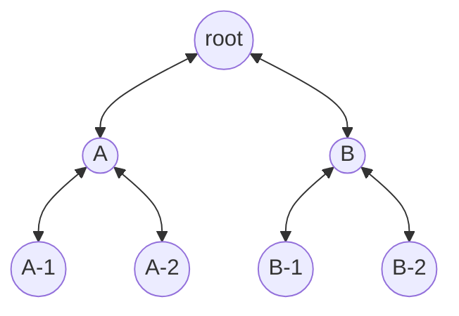

## Query Request Queue Design

### Queue Splitting and Dequeuing Priority

The `RequestQueue` subservice embedded into the scheduler process is responsible for
all decisions regarding enqueuing and dequeuing of query requests.
While the `RequestQueue`'s responsibilities are relatively broad, including the domain logic for
querier-worker connection lifecycles and graceful startup/shutdown logic,
the queuing logic is isolated into a "tree queue" structure and its associated queue algorithms.

The "tree queue" structure serves a purpose much like a discrete priority queue.
Rather than a single queue, the requests are split into many queues,
each of which is located at a leaf node in the tree structure.

The tree structure meets the specific needs of our queue prioritization algorithms, namely:

1. we must select a queue to dequeue from based on two separate algorithms, each with independent state
  1. when traversing the  
* there is a defined hierarchy between queue selection algorithms - one is more important
* the queue selection algorithm based on tenant-querier shuffle sharding can reject
