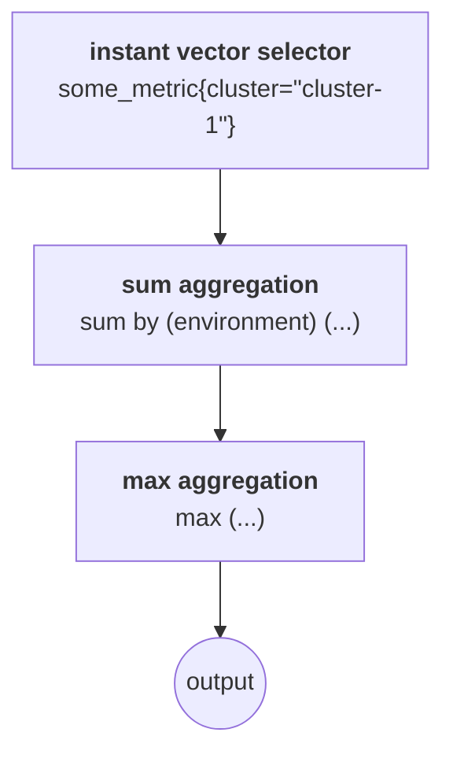

# Mimir Query Engine

This file contains a brief overview of the internals of the Mimir Query Engine, aka MQE.

For an introduction to the engine itself and the problems it tries to solve, check out [this PromCon 2023 talk](https://www.youtube.com/watch?v=3kM2Asj6hcg).

The goal of the engine is to allow evaluating queries over millions of series in a safe, performant and cost-effective way.
To allow this, the engine aims to ensure that peak memory consumption of queriers is not proportional to the number of series selected.
This will make it safe for operators to loosen the various query-related limits without risking the stability of their Mimir cluster or needing to devote enormous amounts of compute resources to queriers.

The key way the engine achieves this is by not loading all the input series into memory at once, and instead streaming them into memory when needed.

For example, let's say we're evaluating the query `sum by (environment) (some_metric{cluster="cluster-1"})`.

Prometheus' PromQL engine will first load all samples for all series selected by `some_metric{cluster="cluster-1"}` into memory.
It will then compute the sum for each unique value of `environment`.
At its peak, Prometheus' PromQL engine will hold all samples for all input series (from `some_metric{cluster="cluster-1"}`) and all samples for all output series in memory at once.

MQE here will instead execute the selector `some_metric{cluster="cluster-1"}` and gather the labels of all series returned.
With these labels, it will then compute all the possible output series for the `sum by (environment)` operation (ie. one output series per unique value of `environment`).
Having computed the output series, it will then begin reading series from the selector, one at a time, and update the running total for the appropriate output series.
At its peak, MQE in this example will hold all samples for one input series and all samples for all output series in memory at once[^1],
a significant reduction compared to Prometheus' PromQL engine, particularly when the selector selects many series.

This idea of streaming can be applied to multiple levels as well. Imagine we're evaluating the query `max(sum by (environment) (some_metric{cluster="cluster-1"}))`.
In MQE, once the result of each group series produced by `sum` is complete, it is passed to `max`, which can update its running maximum seen so far across all groups.
At its peak, MQE will hold all samples for one input series, all samples for all incomplete `sum` group series, and the single incomplete `max` output series in memory at once.

## Internals

Within MQE, a query is represented by a set of linked operators (one for each operation) that together form the query plan.

For example, the `max(sum by (environment) (some_metric{cluster="cluster-1"}))` example from before would have a query plan made up of three operators:

- The instant vector selector operator (`some_metric{cluster="cluster-1"}`)
- The `sum` aggregation operator (`sum by (environment) (...)`), which consumes series from the instant vector selector operator
- The `max` aggregation operator (`max (...)`), which consumes series from the `sum` aggregation operator

Visually, the plan looks like this:

Each of these operators satisfies the `InstantVectorOperator` interface, defined [here](./types/operator.go).
The two key methods of this interface are `SeriesMetadata()` and `NextSeries()`:

`SeriesMetadata()` returns the list of all series' labels that will be returned by the operator[^2].
In our example, the instant vector selector operator would return all the matching `some_metric` series, and the `sum` aggregation operator would return one series for each unique value of `environment`.

`NextSeries()` is then called by the consuming operator to read each series' data, one series at a time.
In our example, the `sum` aggregation operator would call `NextSeries()` on the instant vector selector operator to get the first series' data, then again to get the second series' data and so on.

Elaborating on the example from before, the overall query would proceed like this, assuming the request is received over HTTP:

1. query HTTP API handler calls `Engine.NewInstantQuery()` or `Engine.NewRangeQuery()` as appropriate ([source](./engine.go))
   1. engine parses PromQL expression using Prometheus' PromQL parser, producing an abstract syntax tree (AST) ([source](./query.go))
   1. engine converts AST produced by PromQL parser to query plan ([source](./query.go))
   1. engine returns created `Query` instance
1. query HTTP API handler calls `Query.Exec()`
   1. `Query.Exec()` calls `SeriesMetadata()` on `max` aggregation operator
      1. `max` aggregation operator calls `SeriesMetadata()` on `sum` aggregation operator
         1. `sum` aggregation operator calls `SeriesMetadata()` on instant vector selector operator
            - instant vector selector operator issues `Select()` call, which retrieves labels from ingesters and store-gateways
         1. `sum` aggregation operator computes output series (one per unique value of `environment`) based on input series from instant vector selector
      1. `max` aggregation operator computes output series based on input series from `sum` aggregation operator
         - in this case, there's just one output series, given no grouping is being performed
   1. root of the query calls `NextSeries()` on `max` aggregation operator until all series have been returned
      1. `max` aggregation operator calls `NextSeries()` on `sum` aggregation operator
         1. `sum` aggregation operator calls `NextSeries()` on instant vector selector operator
            - instant vector selector returns samples for next series
         1. `sum` aggregation operator updates its running totals for the relevant output series
         1. if all input series have now been seen for the output series just updated, `sum` aggregation operator returns that output series and removes it from its internal state
         1. otherwise, it calls `NextSeries()` again and repeats
      1. `max` aggregation operator updates its running maximum based on the series returned
      1. if all input series have been seen, `max` aggregation operator returns
      1. otherwise, it calls `NextSeries()` again and repeats
1. query HTTP API handler converts returned result to wire format (either JSON or Protobuf) and sends to caller
1. query HTTP API handler calls `Query.Close()` to release remaining resources

[^1]:
    This isn't strictly correct, as chunks streaming will buffer chunks for some series in memory as they're received over the network, and it ignores the initial memory consumption caused by the non-streaming calls to `SeriesMetadata()`.
    But this applies equally to both engines when used in Mimir.

[^2]:
    This isn't done in a streaming fashion: all series' labels are loaded into memory at once.
    In a future iteration of the engine, `SeriesMetadata()` could be made streaming as well, but this is out of scope for now.

## Implementation notes

### Thread safety

Operators are not expected to be thread-safe: the engine currently evaluates queries from a single goroutine.

### Native histograms and memory pooling

MQE makes extensive use of memory pooling to reduce GC pressure, including for slices that hold `*histogram.FloatHistogram` pointers.

Slices of `promql.HPoint` returned by `types.HPointSlicePool` are not cleared when they are returned. This allows the `FloatHistogram`
instances to be reused for other series or time steps. For example, when filling a `HPointRingBuffer`, range vector selectors will
reuse `FloatHistogram` instances already present in the `HPoint` slice that backs the ring buffer, rather than unconditionally creating
a new `FloatHistogram` instance.

The implication of this is that anywhere that returns a `promql.HPoint` slice `s` to `types.HPointSlicePool` must remove references in
`s` to any `FloatHistogram`s retained after `s` is returned. For example, binary operations that act as a filter retain the
`FloatHistogram`s that satisfy the filter in a new, smaller slice, and return the original unfiltered slice `s` to the pool.

The simplest way to do this is to set the `H` field on `promql.HPoint` to `nil`.
If all points in `s` are being retained, then calling `clear(s)` is also sufficient.

If this is not done, query results may become corrupted due to multiple queries simultaneously modifying the same `FloatHistogram` instance.
This can also manifest as panics while interacting with `FloatHistogram`s.

The same problem does not apply to `*histogram.FloatHistogram` slices returned by `types.HistogramSlicePool`. Slices from this pool are used only by
parts of MQE that do not benefit from reusing `FloatHistogram` instances, and so `types.HistogramSlicePool` clears all slices returned for you.
